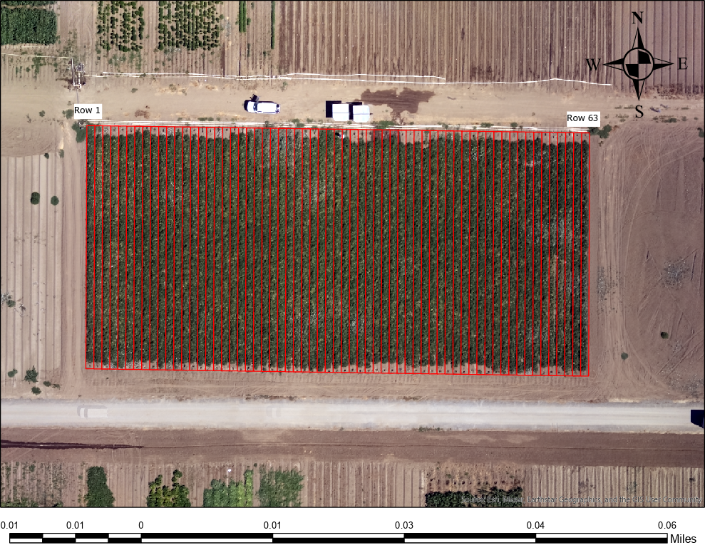

# **08-06-2024 Tomato Irrigation NDVI Analysis**

This repository contains a detailed analysis of NDVI (Normalized Difference Vegetation Index) calculations and shapefile processing from drone imagery collected for a tomato irrigation farm on **08-06-2024**. The primary goal of this analysis is to compute NDVI from the red and near-infrared (NIR) bands of drone imagery and associate the NDVI values with specific rows of the tomato farm, using a shapefile of the farm's layout.

## **Repository Structure**

The repository is organized into several folders and files to make navigation easier. Below is an overview of the structure and contents of each folder:

### 1. **Code**
   - **Folder**: [`/Code`](./Code)
   - This folder contains all the code used to process the drone imagery, compute the NDVI, and analyze the shapefile to extract NDVI values for each row of the tomato farm. 
   - Key steps include:
     - Reading and displaying the red and NIR bands.
     - Calculating NDVI using the formula:
       
       $$\text{NDVI} = \frac{\text{NIR} - \text{RED}}{\text{NIR} + \text{RED}}$$
       
     - Merging shapefile geometries for each row and calculating NDVI statistics such as minimum, maximum, average, and median for each row.

### 2. **Data**
   - **Folder**: [`/Data`](./Data)
   - This folder contains the original drone imagery data used in the analysis, including:
     - **Red Band**: Transparent reflectance red band.
     - **NIR Band**: Transparent reflectance NIR band.
   - These data are critical for computing NDVI, as they represent different wavelengths captured by the drone over the tomato farm.

### 3. **Shapefiles**
   - **Folder**: [`/SHP/DrKisekka_Tomato`](./SHP/DrKisekka_Tomato)
   - This folder contains the shapefiles of the tomato farm, which define the geometries for each row. The shapefiles are used to analyze the NDVI values row by row, identifying variations in vegetation health across the farm.
   - After processing, an updated shapefile is also included, which merges rows that were initially split into separate polygons.

### 4. **CSV Output**
   - **Folder**: [`/CSV`](./CSV)
   - Contains the CSV file output that summarizes the NDVI statistics for each tomato row, including:
     - **Min NDVI**: The minimum NDVI value in the row.
     - **Max NDVI**: The maximum NDVI value in the row.
     - **Avg NDVI**: The average NDVI value in the row.
     - **Median NDVI**: The median NDVI value in the row.
   - This output allows for an easy comparison of NDVI values across different rows to identify areas that may need attention.

### 5. **HTML Output**
   - **File**: [`Tomato_Farm_NDVI_Analysis.html`](https://mohammadrezanarimaniucdavis.github.io/08-06-2024_Tomato_Irrigation_NDVI/Tomato_Farm_NDVI_Analysis.html)
   - This file contains the fully rendered output of the Jupyter notebook, including all code, figures, tables, and results. You can view it directly in your browser by clicking the link above.
   - It provides a detailed step-by-step walkthrough of the entire analysis, from data loading to NDVI calculation and shapefile processing.

## **How to Run the Analysis**

To run the analysis locally, follow these steps:

1. **Clone the repository**:
   ```bash
   git clone https://github.com/MohammadrezaNarimaniUCDavis/08-06-2024_Tomato_Irrigation_NDVI.git
   ```
   
2. **Install the required dependencies**: Ensure that you have a Python environment set up with the necessary libraries like `rasterio`, `geopandas`, `matplotlib`, and `numpy`. You can install them using:
   ```bash
   pip install -r requirements.txt
   ```

Alternatively, you can use `conda` or your preferred package manager.

3. **Run the Jupyter notebook**: Launch Jupyter Notebook and open `Tomato_Farm_NDVI_Analysis.ipynb` to follow the analysis step-by-step.

4. **Output**: The notebook will produce the final NDVI visualizations and CSV outputs containing statistics for each row of the tomato farm.



### Contact Information
For more questions or inquiries about this project, feel free to contact **Mohammadreza Narimani** via email at [mnarimani@ucdavis.edu](mailto:mnarimani@ucdavis.edu).
